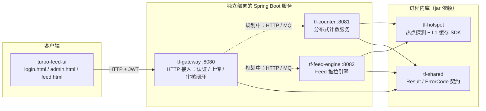

# 系统总体架构

> turbo-feed：短视频 Feed 核心系统——推拉结合 Feed 流 + 分布式计数 + 热点治理，
> UGC 内容图片上传（审核后展示）作为网关侧首个完整业务闭环。
> 当前状态：微服务结构已拆分（3 服务 + 3 库），引擎模块为设计骨架，网关已具备可运行业务链路。

## 1. 系统形态：3 个独立服务 + 3 个库

| 模块 | 形态 | 端口 | 当前职责 |
|---|---|---|---|
| `tf-gateway` | 可执行服务 | 8080 | 登录鉴权（JWT）、UGC 图片上传、审核流转、事件总线（Local / RocketMQ 双实现） |
| `tf-counter` | 可执行服务 | 8081 | 设计骨架（Redis 分桶计数 + MQ 削峰 + 批量落库 + 三级读缓存），待实现 |
| `tf-feed-engine` | 可执行服务 | 8082 | 设计骨架（收件箱 / 大 V outbox / 活跃度分层 / 多路归并），待实现 |
| `tf-hotspot` | 进程内 SDK | — | 滑动窗口热 Key 探测 + 广播 + Caffeine L1，嵌入 counter / feed-engine 进程 |
| `tf-shared` | 纯 POJO 库 | — | `Result` / `ErrorCode` 统一契约，零框架依赖 |
| `tf-benchmark` | 压测模块 | — | 五场景压测器 + Markdown 报告生成 |

> 服务拆分动机、通信矩阵与演进路线详见 [service-split.md](service-split.md)。

## 2. 技术栈与版本锁定

| 组件 | 版本 | 说明 |
|---|---|---|
| Java | 17 | `maven.compiler.release=17`，IDEA 项目 SDK 必须同为 17 |
| Spring Boot | 3.4.3 | BOM 统一托管依赖版本 |
| Spring Cloud | 2024.0.2 | 必须由父 POM 显式 import `spring-cloud-dependencies` 锁定 |
| Spring Cloud Alibaba | 2023.0.3.4 | Sentinel 流量防护；版本不可从命名反推 Spring Cloud 版本，看其 POM parent（4.1.0 → SC 2024.0.x） |
| RocketMQ starter | 2.3.4 | 事件总线跨进程实现，`turbofeed.mq.enabled` 条件启用 |
| Redisson | 3.27.2 | 仅 tf-counter / tf-feed-engine 持有，网关进程不加载 |
| Lombok | 1.18.36（BOM 托管） | 构造器注入 / `@Slf4j` |
| Caffeine / H2 | BOM 托管 | L1 缓存 / "克隆即跑"兜底数据源 |

版本组合教训（详见 changelog）：SC 与 Boot 的 release train 对应关系必须查官方矩阵，SCA 版本命名不能反推 Spring Cloud 版本。

## 3. 关键架构决策

| 决策 | 选择 | 理由 |
|---|---|---|
| 身份传递 | JWT + ThreadLocal 上下文 | userId 不进方法签名，客户端无法伪造 / 越权；`UserContextHolder.requireUserId()` 在业务层显式声明受保护语义 |
| 事件总线 | 端口 `MediaEventPublisher` + Local / RocketMQ 双实现 | 默认本地 Spring 事件保证"克隆即跑"，`turbofeed.mq.enabled=true` 平滑切跨进程，业务代码零改动 |
| 对象存储 | 端口 `MediaStorageClient` + 占位实现 | MinIO（S3 协议）接入时新增实现类即可，容量横向扩容不动代码 |
| 文件校验 | Magic Number 白名单（jpg/png/gif/webp，排除 SVG） | 不信任 Content-Type / 扩展名；SVG 可内嵌脚本有 XSS 风险 |
| 审核模型 | `status` 字段 + 单路径转换（PENDING → APPROVED/REJECTED） | 上传成功 ≠ 前端可见；前端只展示 APPROVED |
| 抽象尺度 | 只为"当下真实存在的职责"建抽象 | 已删除 UploadCommand / ExifCleanerProcessor / MediaReviewStateMachine 三个过度设计（见 changelog 0005 之前的演进） |
| 错误响应 | 统一 `Result` + 全局异常处理器 | Controller 不感知错误拼装；堆栈只进日志不外泄 |

## 4. 通信矩阵（当前 + 规划）

| 链路 | 当前 | 规划 |
|---|---|---|
| UI → tf-gateway | 同步 HTTP + JWT（已实现） | 不变 |
| tf-gateway → 引擎服务 | 无（引擎为骨架） | 同步走 HTTP（Spring Cloud LoadBalancer + RestClient），异步走 RocketMQ 事件总线 |
| 引擎服务 → Redis | 暂排除 Redisson 自动配置（本地无 Redis） | Redis 就绪后删 exclude，补 `spring.data.redis.*` |
| 服务间观测 | actuator health/info（三服务对齐） | Phase 2：Micrometer Tracing + Loki 集中日志（见日志体系规划） |

## 5. 演进路线

| 阶段 | 内容 |
|---|---|
| Phase 1（当前） | 网关业务闭环 + 三服务结构 + 技术文档体系；TraceIdFilter + MQ 上下文传播待落地 |
| Phase 2 | 引擎业务实现（计数 / Feed 推拉）→ 真实跨服务调用；MinIO 接入；Redis 就绪；观测性（Loki / Grafana / Prometheus） |
| Phase 3 | 多机房容灾、容量规划与压测报告（tf-benchmark 驱动） |
