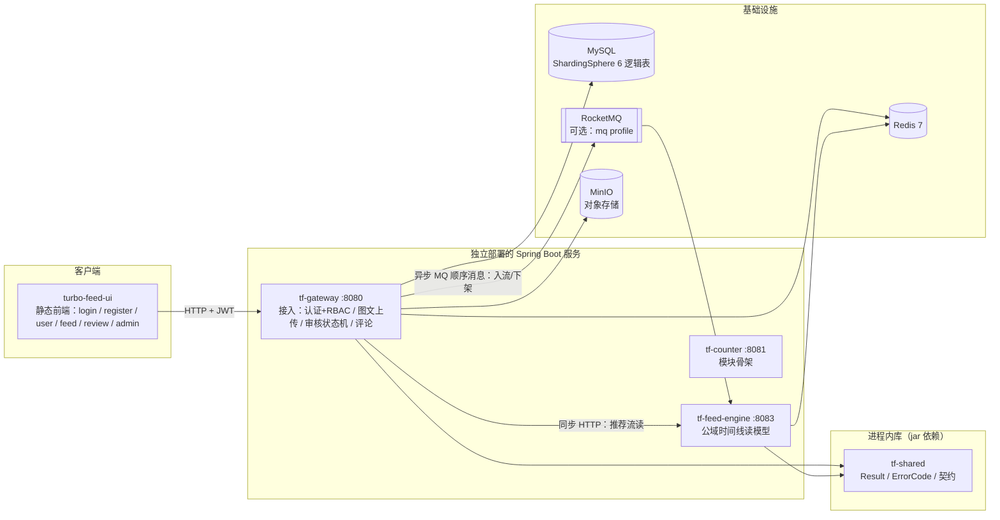

# 系统总体架构

> turbo-feed：短视频 Feed 核心系统——推拉结合 Feed 流 + 分布式计数 + 热点治理，
> UGC 图文上传（一帖多图，审核后展示）作为网关侧首个完整业务闭环。
> **当前状态**：微服务结构已拆分（3 个可执行服务）。网关业务闭环完整；Feed 引擎已具备
> **公域时间线读模型**并承担全部公域读；计数服务、热点治理 SDK、压测模块仍为模块骨架。

## 1. 系统形态：3 个独立服务 + 1 个静态前端

| 模块 | 形态 | 端口 | 当前职责 | 实现状态 |
|---|---|---|---|---|
| `tf-gateway` | 可执行服务 | 8080 | 登录注册（按手机号）+ RBAC、图文上传（一帖多图）、审核状态机与举报申诉闭环、评论、公域流转发 | ✅ 完整 |
| `tf-feed-engine` | 可执行服务 | 8083 | **公域时间线读模型**（多池 ZSET + 反查索引 + 推荐流旁路缓存）、`/internal/**` 接口、MQ 顺序消费 | ✅ 读模型已实现；扇出蓝图未实现 |
| `tf-counter` | 可执行服务 | 8081 | 仅 `CounterApplication` + 配置；声明了 Caffeine / Redisson / H2 | ⬜ 模块骨架 |
| `tf-hotspot` | 进程内 SDK | — | 滑动窗口热 Key 探测 + 广播 + Caffeine L1（设计蓝图） | ⬜ **0 个源文件** |
| `tf-benchmark` | 压测模块 | — | 五场景压测器 + Markdown 报告生成（设计蓝图） | ⬜ **0 个源文件** |
| `tf-shared` | 纯 POJO 库 | — | `Result` / `ErrorCode` / `FeedItemView` / `FeedTimelineEvent`，零第三方依赖 | ✅ |
| `turbo-feed-ui` | 静态前端 | — | 纯 HTML（无构建）：登录 / 注册 / 发布 / 公域 Feed 轮播 / 审核与管理工作台 | ✅ |

> 服务拆分动机、通信矩阵与演进路线详见 [service-split.md](service-split.md)；分片设计见 [sharding.md](sharding.md)。

## 2. 技术栈与版本锁定

| 组件 | 版本 | 说明 |
|---|---|---|
| Java | 17 | `maven.compiler.release=17`，IDEA 项目 SDK 必须同为 17 |
| Spring Boot | 3.4.3 | BOM 统一托管依赖版本（caffeine / h2 / mysql-connector-j / lombok 均由其托管） |
| Spring Cloud | 2024.0.2 | 必须由父 POM 显式 import `spring-cloud-dependencies` 锁定 |
| Spring Cloud Alibaba | 2023.0.3.4 | Sentinel 流量防护；版本不可从命名反推 Spring Cloud 版本，看其 POM parent（4.1.0 → SC 2024.0.x） |
| RocketMQ starter | **2.3.5** | 事件总线 + 时间线顺序消息；`turbofeed.mq.enabled` + `mq` profile 条件启用 |
| ShardingSphere JDBC | **5.5.3** | 声明在 `tf-gateway/pom.xml`；6 张逻辑表分片（见 sharding.md） |
| MinIO SDK | **8.5.7** | 对象存储（`turbofeed.media.storage=minio`，当前默认） |
| Redisson | 3.27.2 | **仅声明在 tf-counter**（尚未实现）；网关与引擎均用官方 `spring-boot-starter-data-redis`（Lettuce） |
| Caffeine / H2 | BOM 托管 | **仅 tf-counter 声明**，当前未被实际使用 |
| Lombok | BOM 托管 | 构造器注入 / `@Slf4j` |

版本组合教训（详见 changelog）：SC 与 Boot 的 release train 对应关系必须查官方矩阵，SCA 版本命名不能反推 Spring Cloud 版本。

## 3. 关键架构决策

| 决策 | 选择 | 理由 |
|---|---|---|
| 身份传递 | JWT + ThreadLocal 上下文 | userId 不进方法签名，客户端无法伪造 / 越权；`UserContextHolder.requireUserId()` 在业务层显式声明受保护语义 |
| 授权模型 | RBAC：角色→权限集 + `@RequirePermission` | 接口按**权限**校验而非按角色名，新增角色只加枚举 + 一行映射，业务零侵入。角色由 `user` 表 `role` 列派生，配置里不存白名单 |
| 内容粒度 | **一帖多图**：一次上传 = 一个 `post_id`，`seq` 定序 | 分片键仍是 `user_id` → 同帖必落同一分片；历史单图数据 `post_id=''` 回退 `media_id`，零迁移 |
| 审核粒度 | **整帖一审** + 6 状态机 | 一帖 N 图同上同下；允许「一帖内一半可见」会让同一内容在不同入口呈现矛盾可见性 |
| 状态流转并发 | **CAS（`AND status=期望前置态`）+ 有界重试** | 消除检查-后-执行的 TOCTOU；整帖多行 UPDATE 会在二级索引与聚簇主键间形成加锁次序反转 → InnoDB 死锁，靠重试吸收（见 changelog 0023） |
| 公域读 | 写时物化时间线（Redis ZSET）+ 独立引擎 | 消灭「跨分片广播扫全表」；读路径 O(log n)、零扫分片库 |
| 事件总线 | 端口 + Local / RocketMQ 双实现 | 默认本地事件保证「克隆即跑」，`turbofeed.mq.enabled=true` 平滑切跨进程，业务代码零改动 |
| 时间线投递 | RocketMQ **顺序消息**（append/remove 同 topic 同消费者） | 按 action 拆 tag/消费者会让同帖 append 与 remove 失序 → 「已下架内容重新出现」的内容安全事故 |
| 对象存储 | 端口 `MediaStorageClient` + 三实现（minio / local / placeholder） | 按配置互斥装配，切换不动业务代码 |
| 文件校验 | Magic Number 白名单（jpg/png/gif/webp，排除 SVG） | 不信任 Content-Type / 扩展名；SVG 可内嵌脚本有 XSS 风险 |
| 引擎降级 | `degraded-mode=empty`（默认） | 引擎不可用时**拒绝跨分片广播回源**——回源会把一次依赖故障放大成全库故障 |
| 抽象尺度 | 只为「当下真实存在的职责」建抽象 | 已删除 UploadCommand / ExifCleanerProcessor / MediaReviewStateMachine 等过度设计 |
| 错误响应 | 统一 `Result` + 全局异常处理器 | Controller 不感知错误拼装；堆栈只进日志不外泄 |

## 4. 通信矩阵

| 链路 | 方式 | 说明 |
|---|---|---|
| UI → tf-gateway | 同步 HTTP + JWT | 唯一对外业务端口 |
| tf-gateway → tf-feed-engine（**读**） | 同步 HTTP | 仅 `GET /internal/feed/recommended`。已配 connect 500ms / read 2s 超时，失败按 `degraded-mode` 降级 |
| tf-gateway → tf-feed-engine（**写**：入流 / 下架） | 异步 RocketMQ 顺序消息 | `append` / `remove` 共用 topic 与消费者，靠 `action` 区分；`syncSendOrderly(hashKey=timelineKey)` + `ConsumeMode.ORDERLY`。**MQ 关闭时**退回同步 HTTP 兜底（`HttpFeedTimelinePublisher`） |
| tf-gateway → 上传事件（触发审核） | 本地事件 / MQ | `MediaEventPublisher` 端口；`mq.enabled=false` 走进程内 `@Async` |
| tf-gateway / tf-feed-engine → Redis | 同步（Lettuce） | 限流、并发护栏、敏感词与状态缓存、公域时间线 |
| tf-gateway → MySQL | 同步（ShardingSphere） | 6 张逻辑表分片 |
| tf-gateway → MinIO | 同步（S3 协议） | 图片对象读写 |
| 服务间鉴权 | **无** | `/internal/**` 依赖内网信任；生产需补服务间令牌 / mTLS |
| 服务发现 | **无** | 网关直连 `base-url`，无注册中心与客户端负载均衡 |
| 服务间观测 | actuator health/info | 规划：Micrometer Tracing + 集中日志 |

> 当前**同步调用面只有 1 个读接口**（推荐流），其余跨服务写路径均已异步化——
> 这也是「服务间通信用 HTTP 还是 RPC」在本项目中收益有限的原因：优化的是一个低频读，
> 而同步调用本身的缺陷（引擎抖动导致写失败）只能靠异步消息解决，换协议解决不了。

## 5. 演进路线

| 阶段 | 内容 |
|---|---|
| 已完成 | 网关业务闭环（认证/RBAC / 一帖多图 / 审核状态机 / 举报申诉 / 评论）、三服务结构、公域时间线读模型拆分、RocketMQ 顺序投递、分片、技术文档体系 |
| Phase 2（近期） | 引擎**扇出**实现（收件箱 / 大 V outbox / 活跃度分层 / 多路归并）、tf-counter 计数、tf-hotspot 热点治理；服务注册与发现 + 跨服务鉴权；观测性（Tracing / Prometheus / 集中日志） |
| Phase 3 | 多机房容灾、容量规划与压测报告（tf-benchmark 驱动） |
